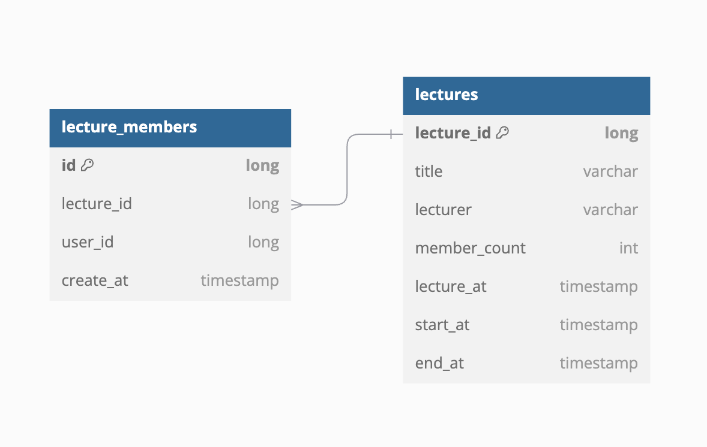

# **요구사항**
- - - 
## 기본 요구사항

### 1. 특강 신청 
+ 특정 userId로 선착순으로 제공되는 특강을 신청하는 API를 작성한다.
+ 동일한 신청자는 동일한 강의에 대해서 한 번의 수강 신청만 성공할 수 있다.
+ 특강은 선착순 30명만 신청 가능하다.
+ 이미 신청자가 30명이 초과되면 이후 신청자는 요청을 실패한다.

### 2. 특강 선택 
+ 날짜별로 현재 신청 가능한 특강 목록을 조회하는 API를 작성한다.
+ 특정 userId로 신청 완료된 특강 목록을 조회하는 API를 작성한다.

## 세부 요구사항
+ 특강 조회 시 userId나 LectureId가 음수 일시 예외가 발생한다.
+ 특강 조회 시 특강 정보가 없는 경우 예외가 발생한다.
+ 신청완료 한 특강을 같은 userId가 다시 신청하면 예외가 발생한다.
+ 신청시 특강일이 이미 지난 경우에는 예외가 발생한다.
+ 특강 신청 기간이 아닌경우에는 예외가 발생한다.

- - -

# ERD

+ 특강의 정보를 나타내는 Lectures테이블 (이름, 강사, 신청인 수, 특강일, 신청시작일, 신청마감일)
+ 신청자 정보를 담는 lecture_member테이블 (특강ID, 신청자ID, 신청일)
+ lecture_member테이블은 lectures 테이블의 pk를 fk로 가지고 있으며 N : 1관계이다.
+ 현재 요구사항을 반영하여 최소한으로 테이블 설계를 했으며, 추후 member테이블, 특강 스케줄 관리테이블 등을 따로 관리 하여도 좋을 것같다고 생각했다.

- - -

# Architecture

> erd에도 보면 테이블이 2개이고 요구사항도 많지 않음을 했고, 이러한 상황에서 어떤 아키텍처가 '클린 아키텍처'인지 고민을 많이 했다.
> 지금처럼 작은 어플리케이션 같은 경우는 불필요한 계층 분리로 인해 구조가 복잡해질 수 있다고 생각했고, 계층 간 호출 오버헤드로 인해 성능이 저하될 가능성도
> 있을 수 있겠다는 생각에, 계층간의 분리의 최소한으로 하게되었다.
> 
> 일단 특이사항으로는 이번에 개발을 통해 JPA 기능인 변경감지, 더티체킹 등 한번 사용해 보고싶다는 생각을 했다. 그래서 erd와 같이 entity에 물리적으로 연관관계를 설정해 주고 개발을 시작했다.

+ Presentation  
  + controller
  + dto
+ Application 
  + facade
  + service
+ Domain 
  + repository
  + entity

Infrastructure 계층 같은경우는 현재 mariadb만 사용하고 있으며, 복잡한 쿼리를 다뤄야 하는 일이 없고,
추후에 다른 데이터베이스, redis 등을 사용해야 할때 추가하여, 확장성을 넓히면 좋을 것 같다고 생각했다.
repository는 entity 별로 따로 두었고, service같은 경우는 현재 어플리케이션의 크기에서 비지니스 로직을 다루기에는 하나로 충분했다.
하지만 하나의 service에서 여러 repository를 호출하고있고, 여러 비지니스 로직을 다루기 때문에 추후에 비지니스로직의 볼륨이 커진다던지, service가 더 늘어날 것을 생각해 복잡성 감소, 결합도 감소, 재사용성 향상 등을 고려해 Application레벨에 facade도 추가 하였다.

presentation레벨에서는 클라이언트에게 http요청을 받을 데이터의 형식을 명확하게 하기위해서 requestDTO와 계층 간 의존성 분리, Entity 객체를 직접 사용하기보다 responseDTO 객체을 사용하여
클라이언트에 반환할 데이터의 구조를 명확히 설정함과 동시에 외부에 노출할 필요가 없는 데이터를 숨길 수 있었다.
